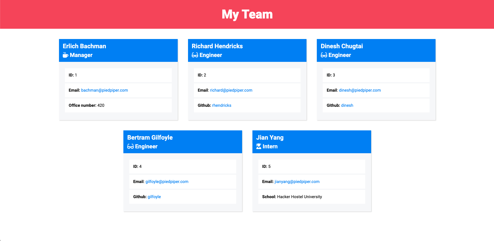

# Object-Oriented-Programming-Team-Profile-Generator

## Description

This application uses Node.js to create a website featuring member profiles for an engineering team.

## Table of Contents

&bull; [Installation](#installation) 
&bull; [Usage](#usage) 
&bull; [License](#license) 
&bull; [How to Contribute](#how-to-contribute) 
&bull; [Tests](#tests) 
&bull; [Questions](#questions)

## Installation

[Node.js](https://nodejs.org/en/), the [Inquirer package](https://www.npmjs.com/package/inquirer/v/8.2.4), and the [Jest testing framework](https://jestjs.io/) are required for this application. 

## Usage

Answer the questions when prompted using the command line in order to create the team profiles and generate the website.    [Video: Team Profile Generator Demo (coming soon)](TK)

## License

Copyright © 2022, Michael Bartnett. Distributed under the [MIT](https://opensource.org/licenses/MIT) License.

## How to Contribute

If you have a suggestion that would make this application better, please fork the repo and create a pull request.

## Tests

Test the application by typing "node index.js" in the command line while in the root directory.

## Questions

Contact: mbartnett@gmail.com, [github.com/mbartnett](https://github.com/mbartnett)    